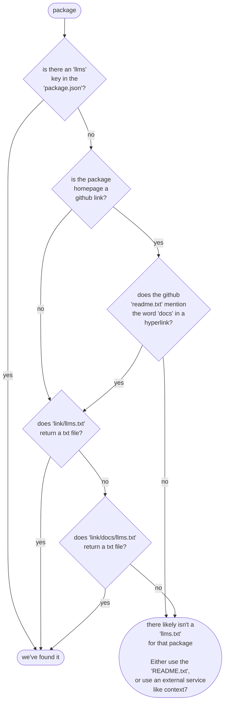

# llms-fetcher
📚 CLI tool to fetch `llms.txt` files for your npm dependencies

## Usage

### Basic Usage

Fetch `llms.txt` files for all dependencies in your `package.json`:

```bash
llms-fetcher
```

### Fetch Specific Packages

You can fetch specific packages without needing a `package.json`:

```bash
llms-fetcher zod lodash react
```

## CLI Options

### Input Options

#### `--package, -p <path>`
Specify a custom path to `package.json` (default: `./package.json`)

```bash
llms-fetcher --package ./packages/core/package.json
```

#### `--deps <types>`
Filter which dependency types to include. Comma-separated list of:
- `prod` - dependencies
- `dev` - devDependencies
- `peer` - peerDependencies
- `optional` - optionalDependencies
- `all` - all dependencies (default)

```bash
llms-fetcher --deps prod,dev        # Only production and dev dependencies
llms-fetcher --deps prod            # Only production dependencies
```

#### Positional Arguments
Specify packages directly to fetch:

```bash
llms-fetcher react @types/react
```

### Output Options

#### `--output, -o <dir>`
Custom output directory (default: `docs/llms`)

```bash
llms-fetcher --output ./context/dependencies
```

#### `--filename, -f <pattern>`
Filename pattern for output files. Use `{name}` as a placeholder for the package name (default: `{name}`)

```bash
llms-fetcher --filename "llms-{name}"
```

#### `--extension, -e <ext>`
File extension for output files (default: `txt`)

```bash
llms-fetcher --extension md
```

### Behavior Options

#### `--dry-run`
Preview what would be done without writing any files

```bash
llms-fetcher --dry-run
```

#### `--fallback <strategy>`
Strategy when `llms.txt` is not found:
- `none` (default) - Skip packages without `llms.txt`
- `readme` - Fall back to README.md from GitHub
- `empty` - Create an empty file with a placeholder message
- `skip` - Same as `none`

```bash
llms-fetcher --fallback readme     # Use README.md as fallback
llms-fetcher --fallback empty      # Create empty files
```

##### Fallback Examples

**With readme fallback:**
```bash
llms-fetcher --fallback readme
```

Results in:
```
✅ package-name: Using readme fallback -> package-name.txt
```

**With empty fallback:**
```bash
llms-fetcher --fallback empty
```

Creates files containing:
```
# package-name

No llms.txt found for this package.
```

### Verbosity Options

#### `--quiet, -q`
Only show errors (minimal output)

```bash
llms-fetcher --quiet
```

#### `--verbose, -v`
Show detailed output including:
- Network requests being made
- URLs being checked
- Debug information

```bash
llms-fetcher --verbose
```

**Note:** If both `-q` and `-v` are specified, the last one wins.

### Filename Sanitization Options

Customize how special characters in package names are sanitized:

#### `--space-replace <char>`
Character to replace spaces in filenames (default: `_`)

```bash
llms-fetcher --space-replace "_"
```

#### `--slash-replace <char>`
Character to replace slashes in filenames (default: `-`)

```bash
llms-fetcher --slash-replace "-"
```

#### `--at-replace <char>`
Character to replace `@` in scoped package names (default: empty string)

```bash
llms-fetcher --at-replace ""
```

**Example:** `@types/node` becomes `types-node.txt` with default settings

## Complete Examples

### Example 1: Fetch with readme fallback and save as markdown
```bash
llms-fetcher \
  --fallback readme \
  --extension md \
  --output ./docs/handbook
```

### Example 2: Only production dependencies with custom naming
```bash
llms-fetcher \
  --deps prod \
  --filename "{name}-reference" \
  --extension txt \
  --output ./context/prod
```

### Example 3: Fetch specific packages with custom sanitization
```bash
llms-fetcher @types/node @types/react \
  --space-replace "_" \
  --slash-replace "_" \
  --at-replace "at_"
```

This might create:
- `at_types_node.txt`
- `at_types_react.txt`

### Example 4: Verbose dry run with all dependencies
```bash
llms-fetcher \
  --deps all \
  --dry-run \
  --verbose
```

### Example 5: Complex workflow - production deps with empty fallback
```bash
llms-fetcher \
  --deps prod \
  --fallback empty \
  --output ./docs/llms-production \
  --quiet
```

## Output Structure

By default, files are saved to:
```
docs/llms/
  ├── zod.txt
  ├── lodash.txt
  └── [package-name].txt
```

With `--fallback readme`, successful files may include fallback indicators in the summary.

## How It Works

The tool searches for `llms.txt` files in this order:

1. Check the package's `package.json` for an `llms` or `llmsFull` field
2. Try standard URLs: `{homepage}/llms.txt` and `{homepage}/docs/llms.txt`
3. If GitHub repository, search README for links containing "docs"
4. Apply fallback strategy if specified



## Exit Codes

- `0` - Success
- `1` - Package.json not found or cannot be parsed

## Contributing

Issues and contributions welcome! Report bugs at: https://github.com/balazshevesi/llms-fetcher/issues
